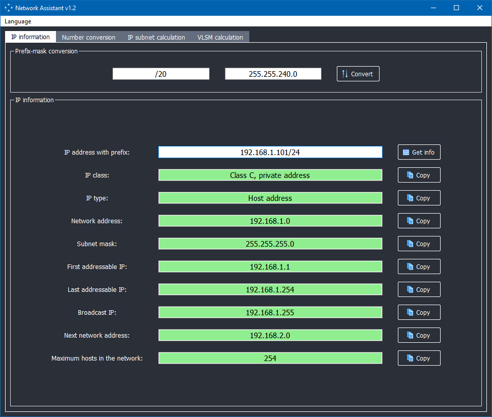
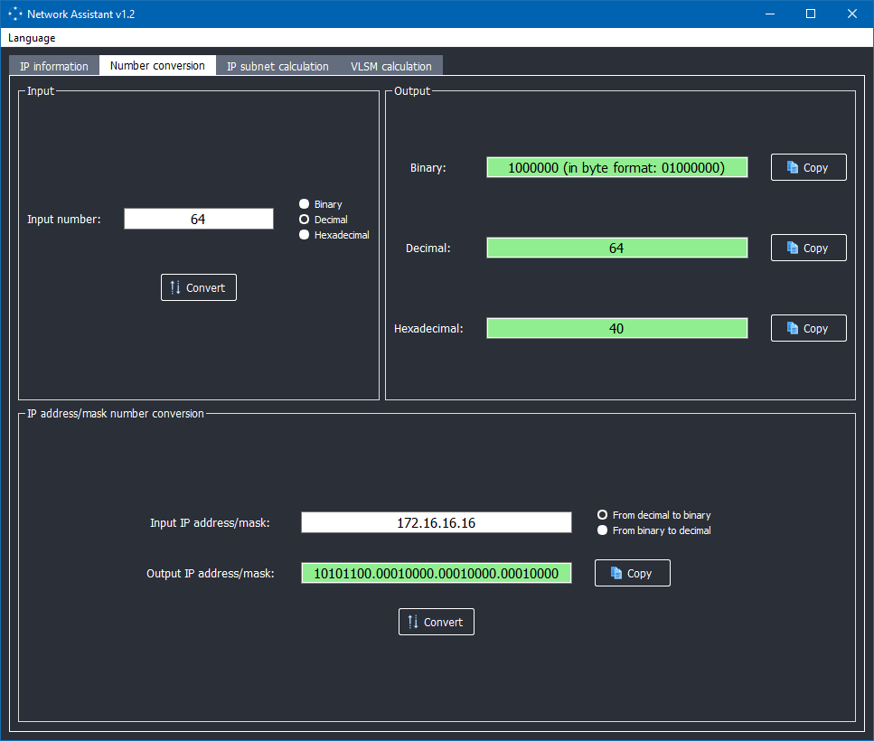
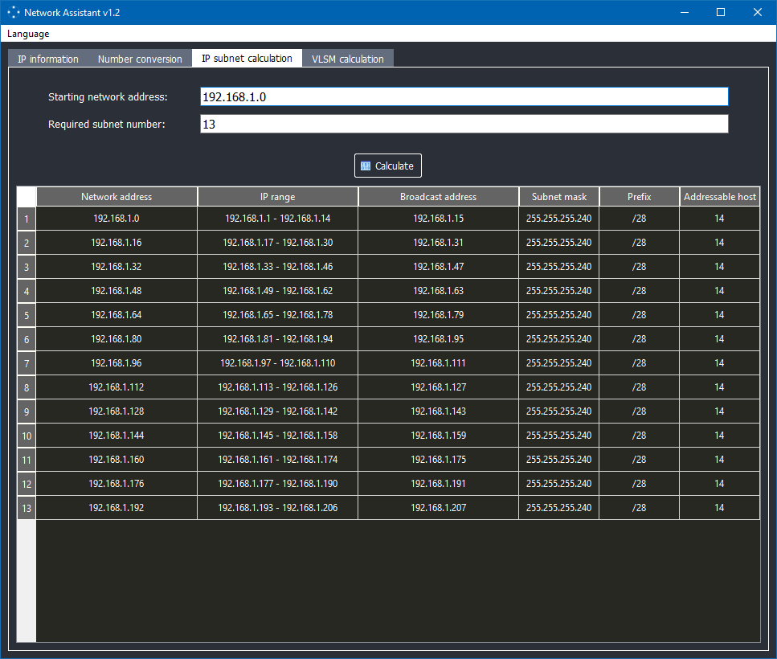
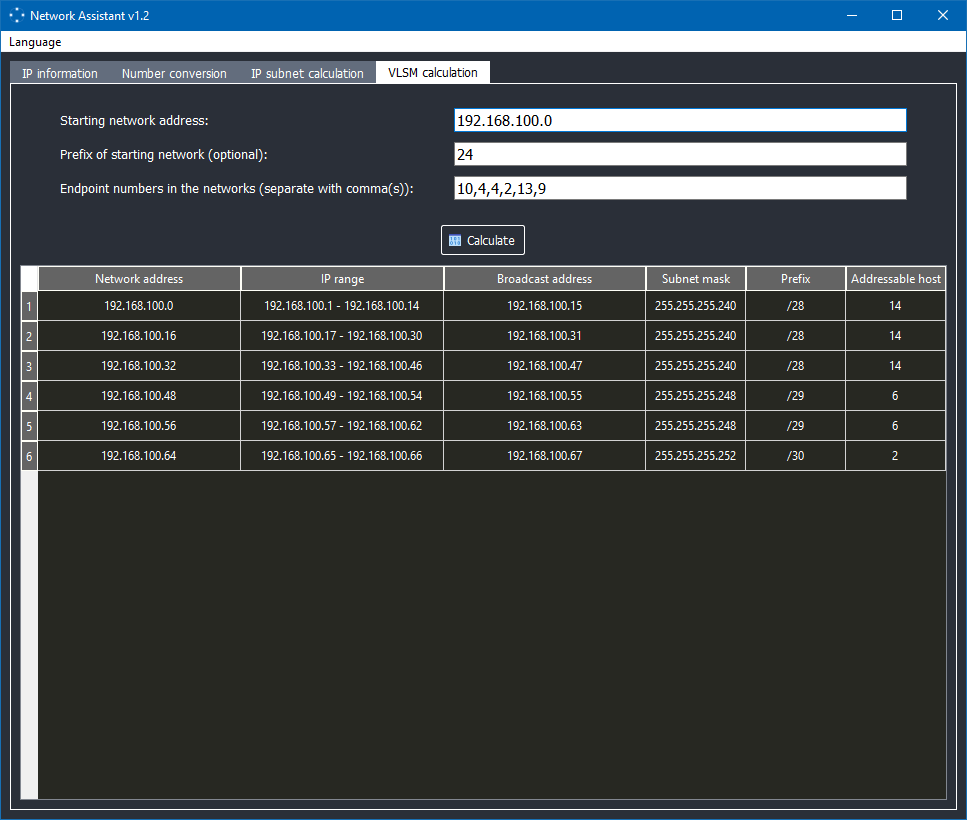

# Network Assistant
A simple IP networking utility with some extras.<br/>
The application is available in English and in Hungarian language as well.<br/>
This application has been written in Python with PySide2 framework.

## Features
- IP information
    - Prefix and subnet mask conversion 
    - IP information from IP address and prefix
- Number conversion
    - Number conversion between binary, decimal and hexadecimal
    - IP address/subnet mask number conversion
- IP subnet calculation
- VLSM (Variable-Length Subnet Masking) calculation

## Requirements
- [Python 3.6 or newer](https://www.python.org/downloads/)
- [xclip package (only on Linux)](https://launchpad.net/ubuntu/+source/xclip)
- [Git (for project cloning)](https://git-scm.com/)

## Getting started
- **On Windows:**
    - Open a terminal and clone the project:
        
        ```bash
        git clone https://github.com/antarn88/NetworkAssistant.git
        ```
    - Create a virtual environment:
    
        ```bash
        cd NetworkAssistant
        python -m venv venv
        ```
    - And activate it:
    
        ```bash
        venv\Scripts\activate
        ```
    - Upgrade pip and install the requirements:
    
        ```bash
        python -m pip install --upgrade pip
        pip install -r requirements.txt
        ```
    - Then launch the application:
    
        ```bash
        NetworkAssistant.pyw
        ```
- **On Linux:**
    - Install the required packages first, if you haven't already:
    
        ```bash
        apt update
        sudo apt install python3 python3-venv xclip git -y
        ```
      
    - Clone the project:
    
        ```bash
        git clone https://github.com/antarn88/NetworkAssistant.git
        ```
    - Create a virtual environment:
    
        ```bash
        cd NetworkAssistant
        python3 -m venv venv
        ``` 
    - And activate it:
        ```bash
        source venv/bin/activate
        ```
    - Upgrade pip and install the requirements:
        ```bash
        python -m pip install --upgrade pip
        pip install -r requirements.txt
        ```
    - Then launch the application:
        ```bash
        python NetworkAssistant.pyw
        ```

## Usage
Later when you would like to use the application, open a terminal
and navigate to the folder where you cloned the project to,
activate the virtual environment and launch the application:

- **On Windows:**

    ```bash
    venv\Scripts\activate
    NetworkAssistant.pyw
    ```
- **On Linux:**

    ```bash
    source venv/bin/activate
    python NetworkAssistant.pyw    
    ```

## Download Windows binaries
Download latest Windows binaries:<br/>
- [NetworkAssistant_1.2_win32.zip](https://github.com/antarn88/NetworkAssistant/releases/download/v1.2/NetworkAssistant_1.2_win32.zip)
- [NetworkAssistant_1.2_win64.zip](https://github.com/antarn88/NetworkAssistant/releases/download/v1.2/NetworkAssistant_1.2_win64.zip)

## Screenshots
**Ip information:**



**Number conversion:**



**Ip subnet calculation:**



**VLSM calculation:**


